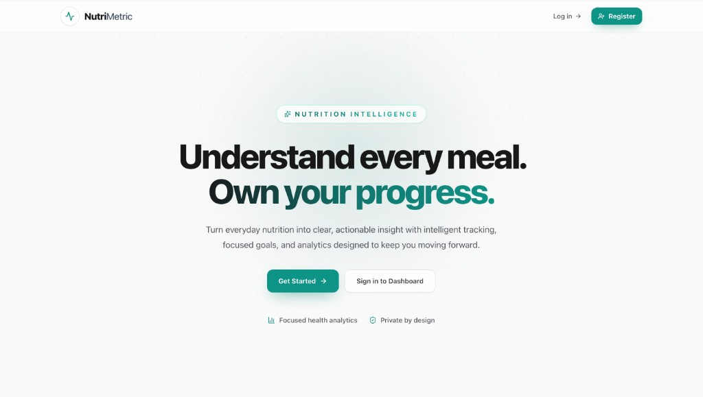
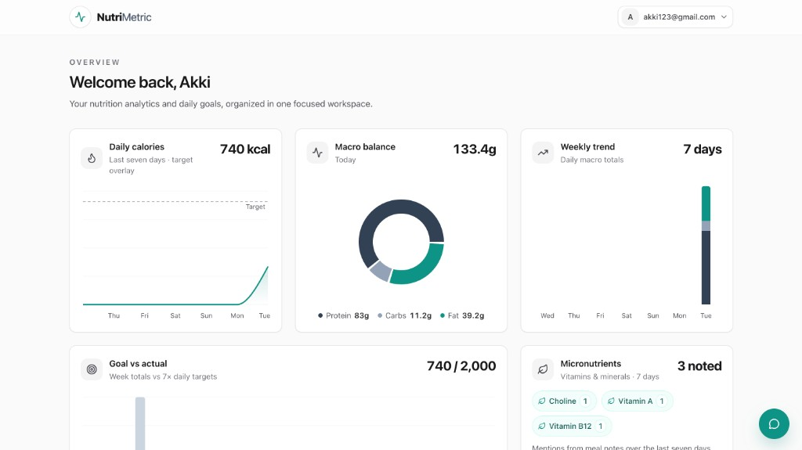
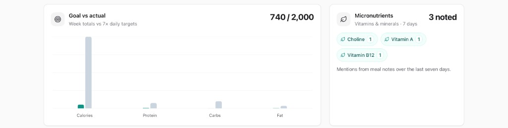
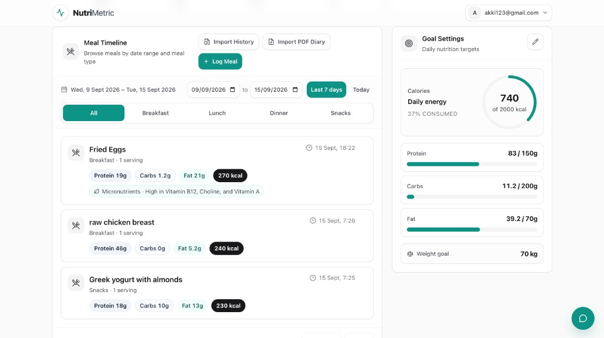
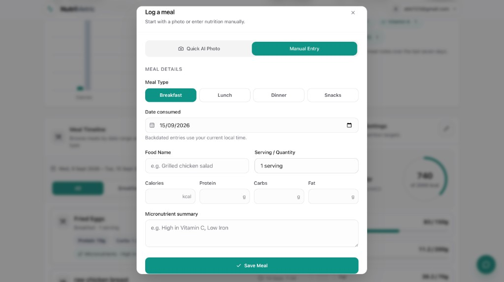
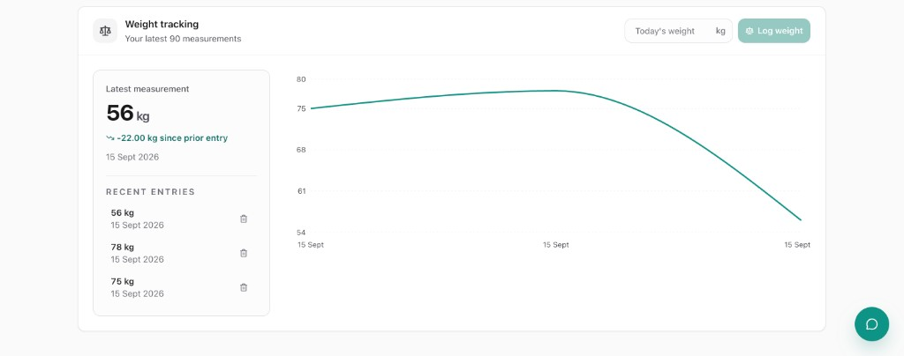
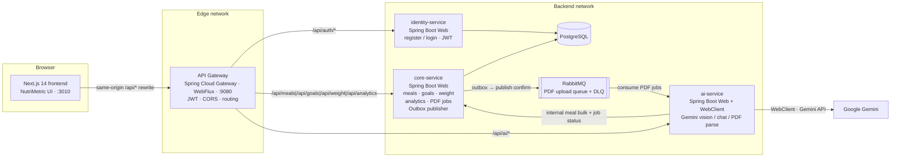

# NutriMetric: Event-Driven Calorie & Nutrition Intelligence

- **Live Demo URL:** _[placeholder — add deployed URL]_
- **Demo Video Link:** _[placeholder — add walkthrough recording]_

> **Operational note for reviewers.** The full microservices stack (PostgreSQL, RabbitMQ, identity, core, AI, API gateway, and the Next.js UI) is orchestrated with Docker Compose. Only loopback ports are published: the app at [http://localhost:3010](http://localhost:3010) and the API gateway at [http://localhost:9080](http://localhost:9080). Postgres, RabbitMQ, and the Java services stay on internal Docker networks. A real `GEMINI_API_KEY` is required for photo extraction, chat, and PDF diary parsing. Image-only / scanned PDFs are not supported—tabular text exports are.

## What It Does

NutriMetric is an end-to-end, event-driven SaaS application for tracking nutrition. Users set calorie and macro goals, log meals (manually or from photos), import food diaries from PDF in the background, and inspect weekly trends on a React bento-grid dashboard. Multimodal AI (Gemini) powers photo extraction and a conversational assistant for logging, goal checks, and weekly summaries—without collapsing the product into a single-process CRUD demo.

## Product Walkthrough

Screenshots below follow the reviewer path: marketing entry → analytics → adherence → meals → multimodal logging → weight.

<p align="center">
  <strong>1 · Landing</strong><br/>
  <sub>Brand-first entry with register / sign-in CTAs</sub>
</p>

<p align="center">
  
</p>

<p align="center">
  <strong>2 · Dashboard overview</strong><br/>
  <sub>Bento-grid analytics: daily calories, macro balance, and weekly trend</sub>
</p>

<p align="center">
  
</p>

<p align="center">
  <strong>3 · Goal vs actual & micronutrients</strong><br/>
  <sub>Week totals against 7× daily targets, plus vitamin/mineral mentions from meal notes</sub>
</p>

<p align="center">
  
</p>

<p align="center">
  <strong>4 · Meal timeline & goal settings</strong><br/>
  <sub>Date and meal-type filters beside live calorie, macro, and weight-goal progress</sub>
</p>

<p align="center">
  
</p>

<table>
  <tr>
    <td align="center" width="50%" valign="top">
      <strong>5 · Log a meal</strong><br/>
      <sub>AI photo extract or manual entry</sub><br/><br/>
      
    </td>
    <td align="center" width="50%" valign="top">
      <strong>6 · Weight tracking</strong><br/>
      <sub>History list plus trend chart</sub><br/><br/>
      
    </td>
  </tr>
</table>

## Why I Built This

The engineering goal was to move past a simple Next.js + REST CRUD app and exercise production-shaped distributed systems problems:

- **Asynchronous job queues** so bulk PDF imports never block the request path
- **Multimodal AI parsing** with strict JSON schemas and validation before persistence
- **Transactional integrity** via the outbox pattern (no dual-write between Postgres and RabbitMQ)
- **Microservices routing** through a JWT-aware API gateway that owns CORS, auth, and service fan-out

The product surface is a calorie tracker; the evaluation target is reliability, isolation, and operational clarity under AI and async workloads.

## Core User Flows

### Multimodal meal logging (AI photo extraction)

1. Authenticated user opens **Log Meal** and uploads a plate photo or nutrition label.
2. The browser posts multipart data to the gateway → **ai-service** (`POST /api/ai/extract-image`).
3. Gemini returns structured nutrition (name, calories, macros, micronutrient summary).
4. The UI pre-fills the meal form; the user confirms meal type, quantity, and timestamp, then persists via **core-service** (`POST /api/meals`).

### Asynchronous PDF bulk imports

1. User uploads a tabular nutrition diary PDF (`POST /api/meals/import-pdf`).
2. **core-service** stores the artifact, creates a `PdfImportJob`, and writes an **outbox** event in the same database transaction.
3. A scheduled publisher confirms delivery to **RabbitMQ**; **ai-service** consumes, extracts text, parses meals with Gemini, and bulk-inserts through core.
4. The frontend short-polls job status and refreshes the meal feed when the import completes—without freezing the UI on long AI work.

### Conversational AI chat (weekly summaries and actions)

1. The floating chat widget sends natural language to `POST /api/ai/chat` with an idempotency key.
2. **ai-service** classifies intent (log meal, check/update goals, daily/weekly summary, general nutrition Q&A).
3. Side effects go through **core-service** (meals, goals, weekly analytics); summaries are grounded in stored data, not invented totals.

## Architecture Diagram



## Tech Stack & Roles

| Component | Library / Runtime | Role |
| --- | --- | --- |
| Frontend | Next.js 14 (App Router) | Auth-gated dashboard, meal/PDF modals, chat widget; rewrites `/api/*` to the gateway |
| UI system | Tailwind CSS | Dense bento-grid layout, forms, and empty/error states |
| Charts | Recharts | Weekly calorie trend, macro balance, goal vs actual, micronutrient mentions |
| API Gateway | Spring Cloud Gateway (WebFlux) | JWT validation, CORS, path-based routing to identity / core / AI |
| Identity | Spring Boot Web | Register/login, password hashing, JWT issuance |
| Core domain | Spring Boot Web + JPA | Meals, goals, weight, weekly analytics, PDF job lifecycle, outbox |
| AI workload | Spring Boot Web + WebFlux `WebClient` | Gemini calls for image extract, chat intents, PDF diary parsing |
| Database | PostgreSQL | System of record for users, goals, food entries, weight, jobs, outbox |
| Broker | RabbitMQ | Decouples PDF import publishing from AI consumption; DLQ for poison messages |
| LLM / Vision | Gemini (`gemini-3.6-flash` as configured) | Multimodal nutrition extraction, chat classification, diary structuring |

## Key Technical Achievements

**Transactional Outbox for PDF uploads.** Creating a PDF job and notifying the broker in two independent writes invites lost or duplicate work. NutriMetric writes the job row and outbox event in one Postgres transaction; a publisher with RabbitMQ confirms drains the outbox. That closes the classic dual-write failure mode between the database and the message broker.

**Optimistic UI and short-polling for async imports.** Upload returns as soon as the job is queued. The meal feed polls import status and merges new entries when AI finishes, so long Gemini/PDF work never blocks the browser thread or the gateway request path.

**Dead-letter queues and artifact cleanup.** Failed PDF consumers route to a durable DLQ. Import directories and temporary extraction artifacts are removed after success or terminal failure so disk and queue state do not accumulate silent debris.

**Idempotent meal writes.** Chat and import paths stamp idempotency keys so retries do not double-insert the same meal under transient network or broker redelivery.

**Service isolation and least exposure.** Only the frontend and gateway are published on loopback. Identity, core, AI, Postgres, and RabbitMQ remain on internal networks; AI has a dedicated egress path for Gemini.

## Architecture Decisions

### Why RabbitMQ?

Gemini parsing is latency-variable and CPU/IO heavy relative to a CRUD request. RabbitMQ decouples the user’s upload HTTP path from blocking AI generation. Core stays responsive; AI workers scale and fail independently; DLQs make poison PDFs operable instead of infinite retry loops.

### Why microservices?

Identity (auth), core (domain + persistence), and AI (unpredictable external model I/O) have different failure domains and scaling profiles. Separating them keeps a Gemini outage from taking down login or meal reads, lets the gateway enforce a single auth/CORS policy, and forces explicit contracts (`X-User-Id`, internal API keys) instead of a shared monolith classpath.

### Why the bento-grid UI?

Nutrition review is a multi-signal problem: today’s macros, seven-day trends, goal adherence, micronutrient notes, meals, and weight. A dense bento-grid presents those signals in one scannable viewport—closer to an operations dashboard than a marketing landing page—so reviewers can evaluate product completeness and data fidelity quickly.

### Why an API gateway in front of Spring services?

Browsers talk to one origin (`/api/*` via Next rewrites). The gateway centralizes JWT verification, strips spoofable identity headers, applies CORS, and routes by path. Downstream services trust gateway-injected user context rather than re-implementing auth filters inconsistently.

## How To Run It

**Prerequisites**

- Docker and Docker Compose
- A Google Gemini API key

**Environment setup**

```bash
cd calorie-tracker-backend
cp .env.example .env
```

Edit `.env` and replace every `change-me` value. At minimum set:

- `GEMINI_API_KEY` — required for photo extract, chat, and PDF parsing
- `JWT_SECRET` — at least 32 bytes of high-entropy secret
- `INTERNAL_API_KEY` — independent secret for service-to-service calls
- Postgres and RabbitMQ credentials

The Compose file lives in `calorie-tracker-backend/` and also builds the frontend image from `../calorie-tracker-frontend`.

**Run**

```bash
cd calorie-tracker-backend
docker compose up --build -d
docker compose ps
```

**Open**

- Application: [http://localhost:3010](http://localhost:3010)
- API gateway: [http://localhost:9080](http://localhost:9080)

Stop containers without deleting volumes:

```bash
docker compose down
```

Deeper assumptions (chat scope, PDF text-only limit, unpublished internal ports) are documented in [`calorie-tracker-backend/README.md`](calorie-tracker-backend/README.md).

## What I Used AI For

AI assistance accelerated implementation and review: Tailwind layout boilerplate, Recharts chart formatting, prompt iteration, and debugging hypotheses from logs. The distributed systems design was hand-architected and validated: service boundaries, gateway auth topology, outbox + RabbitMQ delivery, PDF job lifecycle, idempotent meal writes, and the chat intent contract against core APIs.

## What I Would Change With 4 More Weeks

- Add CI/CD (build, test, image publish, compose/smoke deploy) on every merge
- Produce Kubernetes manifests (or Helm) with readiness/liveness, resource limits, and secrets injection
- Instrument OpenTelemetry traces across gateway → identity/core/AI → RabbitMQ → Gemini calls
- Replace short-polling for PDF job status with authenticated WebSocket or SSE push
- Persist pending chat goal confirmations (today in-memory) and add structured micronutrient quantities if graders expect RDA-style micros
- Expand automated tests around goals/meals controllers and frontend critical paths
- Harden secrets management (no long-lived compose env files) and add latency dashboards (p50/p95) for extract and import stages
